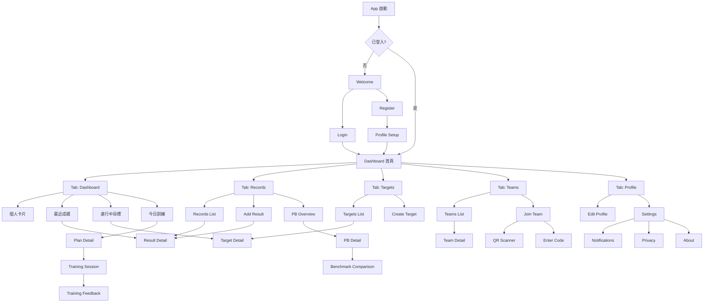
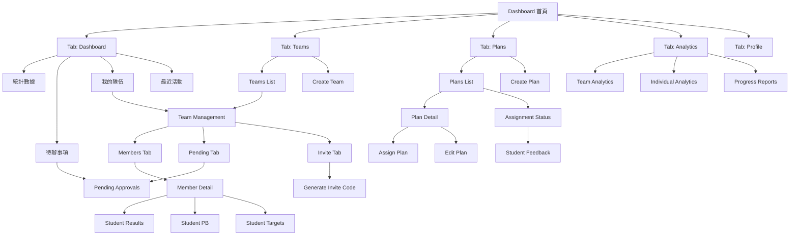

# AquaTrack 導航架構 (Navigation Structure)

## 目錄
1. [導航系統總覽](#1-導航系統總覽)
2. [資訊架構圖](#2-資訊架構圖)
3. [學員端導航結構](#3-學員端導航結構)
4. [教練端導航結構](#4-教練端導航結構)
5. [通用導航模式](#5-通用導航模式)
6. [深層連結規範](#6-深層連結規範)
7. [導航轉場動畫](#7-導航轉場動畫)

---

## 1. 導航系統總覽

### 1.1 導航層級

```
Level 0: 認證層 (Auth Layer)
├─ Welcome Screen
├─ Login Screen
└─ Registration Screen

Level 1: 主導航 (Main Navigation)
├─ Tab Bar Navigation (學員/教練各不同)
└─ Side Menu (選單抽屜)

Level 2: 次要導航 (Secondary Navigation)
├─ Stack Navigation (頁面堆疊)
├─ Modal Navigation (彈出視窗)
└─ Bottom Sheet Navigation (底部彈出)

Level 3: 詳細頁面 (Detail Pages)
└─ Full Screen Navigation
```

### 1.2 導航元件類型

| 元件類型 | 使用場景 | 返回方式 |
|---------|---------|---------|
| **Tab Bar** | 主要功能切換 | 不可返回 |
| **Stack** | 線性流程、詳細頁面 | 返回按鈕/手勢 |
| **Modal** | 獨立任務、表單 | 關閉按鈕/向下滑動 |
| **Bottom Sheet** | 快速選擇、篩選 | 向下滑動/背景點擊 |
| **Drawer** | 設定、次要功能 | 側滑手勢/背景點擊 |

---

## 2. 資訊架構圖

### 2.1 完整資訊架構（學員視角）



### 2.2 完整資訊架構（教練視角）



---

## 3. 學員端導航結構

### 3.1 Bottom Tab Bar（主導航）

```
┌─────────────────────────────────────┐
│                                     │
│         [主要內容區域]               │
│                                     │
├─────────────────────────────────────┤
│ [🏠] [📊] [🎯] [👥] [👤]           │
│ 首頁  成績  目標  隊伍  我的         │
└─────────────────────────────────────┘
```

**Tab 配置：**

| Tab | 圖示 | 標籤 | 主要功能 | Badge |
|-----|------|------|---------|-------|
| 1 | 🏠 | 首頁 | Dashboard | 無 |
| 2 | 📊 | 成績 | Records & PB | 新 PB |
| 3 | 🎯 | 目標 | Targets | 達成/逾期 |
| 4 | 👥 | 隊伍 | Teams | 通知數 |
| 5 | 👤 | 我的 | Profile | 無 |

### 3.2 頁面堆疊結構（學員）

#### Tab 1: 首頁 (Dashboard)
```
Dashboard (Root)
└─ Result Detail
   └─ Edit Result
└─ Target Detail
   └─ Edit Target
└─ Plan Detail
   └─ Training Session
      └─ Training Feedback
```

#### Tab 2: 成績 (Records)
```
Records List (Root)
├─ Add Result (Modal)
├─ Result Detail
│  └─ Edit Result (Modal)
└─ PB Overview
   └─ PB Detail
      ├─ Benchmark Comparison
      │  └─ Create Target (Modal)
      └─ Historical Results
```

#### Tab 3: 目標 (Targets)
```
Targets List (Root)
├─ Create Target (Modal)
└─ Target Detail
   ├─ Edit Target (Modal)
   └─ Related Results
```

#### Tab 4: 隊伍 (Teams)
```
Teams List (Root)
├─ Join Team (Modal)
│  ├─ QR Scanner
│  └─ Enter Code
│     └─ Team Preview (Modal)
└─ Team Detail
   ├─ Members List
   ├─ Team Plans
   └─ Team Leaderboard
```

#### Tab 5: 我的 (Profile)
```
Profile (Root)
├─ Edit Profile (Modal)
├─ Settings
│  ├─ Notifications Settings
│  ├─ Privacy Settings
│  ├─ Language Settings
│  └─ Theme Settings
├─ Help & Support
├─ About
└─ Logout (Confirmation)
```

### 3.3 額外獨立流程（學員）

```
任何頁面
└─ 🔍 Search (Modal)
└─ 🔔 Notifications (Modal/Sheet)
└─ Leaderboard (從多處進入)
   ├─ My Team Leaderboard
   ├─ National Leaderboard
   └─ Age Group Leaderboard
      └─ Athlete Profile
```

---

## 4. 教練端導航結構

### 4.1 Bottom Tab Bar（主導航）

```
┌─────────────────────────────────────┐
│                                     │
│         [主要內容區域]               │
│                                     │
├─────────────────────────────────────┤
│ [🏠] [👥] [📋] [📊] [👤]           │
│ 首頁  隊伍  課表  數據  我的         │
└─────────────────────────────────────┘
```

**Tab 配置：**

| Tab | 圖示 | 標籤 | 主要功能 | Badge |
|-----|------|------|---------|-------|
| 1 | 🏠 | 首頁 | Dashboard | 待辦數 |
| 2 | 👥 | 隊伍 | Teams | 待審核 |
| 3 | 📋 | 課表 | Plans | 回饋數 |
| 4 | 📊 | 數據 | Analytics | 無 |
| 5 | 👤 | 我的 | Profile | 無 |

### 4.2 頁面堆疊結構（教練）

#### Tab 1: 首頁 (Dashboard)
```
Dashboard (Root)
├─ Pending Approvals
│  └─ Applicant Detail
│     ├─ Approve (Confirmation)
│     └─ Reject (Reason Modal)
└─ Recent Activity Detail
```

#### Tab 2: 隊伍 (Teams)
```
Teams List (Root)
├─ Create Team (Modal)
└─ Team Management
   ├─ Members Tab
   │  └─ Member Detail
   │     ├─ Student Results
   │     ├─ Student PB
   │     ├─ Student Targets
   │     ├─ Assign Plan (Modal)
   │     └─ Remove Member (Confirmation)
   ├─ Pending Tab
   │  └─ Approval Flow (同 Dashboard)
   └─ Invite Tab
      └─ Generate Invite Code (Modal)
         └─ Share Options (Sheet)
```

#### Tab 3: 課表 (Plans)
```
Plans List (Root)
├─ Create Plan
│  ├─ Basic Info
│  ├─ Add Sets
│  │  └─ Set Detail (Modal)
│  └─ Preview & Save
├─ Plan Detail
│  ├─ Edit Plan
│  ├─ Assign Plan (Modal)
│  │  ├─ Select Teams
│  │  ├─ Select Students
│  │  └─ Set Schedule
│  └─ Assignment Status
│     └─ Student Feedback
│        └─ Coach Reply (Modal)
└─ Templates
   └─ Use Template
```

#### Tab 4: 數據 (Analytics)
```
Analytics Dashboard (Root)
├─ Team Analytics
│  ├─ Performance Charts
│  ├─ Attendance Reports
│  └─ Progress Tracking
├─ Individual Analytics
│  └─ Student Comparison
└─ Export Reports (Sheet)
```

#### Tab 5: 我的 (Profile)
```
Profile (Root)
├─ Edit Profile (Modal)
├─ Coach Settings
│  └─ 同學員設定
└─ Switch to Student Mode (Confirmation)
```

---

## 5. 通用導航模式

### 5.1 Modal 彈出視窗

**使用時機：**
- 建立新項目（成績、目標、課表、隊伍）
- 編輯表單
- 確認操作
- 快速任務（不需要複雜導航）

**展示方式：**
```
全螢幕 Modal (Full Screen)
- 複雜表單
- 多步驟流程

卡片式 Modal (Card)
- 簡單表單
- 確認對話框

底部彈出 (Bottom Sheet)
- 選擇器
- 篩選器
- 快速操作
```

**關閉方式：**
- 頂部 [×] 關閉按鈕
- 向下滑動手勢
- 點擊背景遮罩
- 完成任務後自動關閉

### 5.2 抽屜選單 (Drawer Menu)

**位置：** 左側滑出

**內容：**
```
┌─────────────────────┐
│ [頭像] 使用者名稱    │
│ user@email.com       │
├─────────────────────┤
│ 🏠 首頁              │
│ 📊 成績記錄          │
│ 🎯 我的目標          │
│ 👥 我的隊伍          │
│ 🏆 排行榜            │
│ 📋 訓練計畫          │
├─────────────────────┤
│ ⚙️ 設定              │
│ 💡 使用說明          │
│ 📧 客服中心          │
│ ℹ️ 關於我們          │
├─────────────────────┤
│ 🚪 登出              │
└─────────────────────┘
```

**使用時機：**
- 快速切換主要功能
- 訪問設定和幫助
- 顯示使用者資訊

### 5.3 頂部導航列 (App Bar)

**標準配置：**
```
┌─────────────────────────────────────┐
│ [←/☰]  頁面標題           [圖示] [⋮] │
└─────────────────────────────────────┘
```

**元件說明：**
- **左側：** 返回箭頭 [←] 或選單按鈕 [☰]
- **中央：** 頁面標題或搜尋框
- **右側：** 操作按鈕（新增、搜尋、更多選項）

**不同頁面配置：**

| 頁面類型 | 左側 | 中央 | 右側 |
|---------|-----|------|-----|
| Root Tab | ☰ | 標題 | 🔔 |
| Stack Page | ← | 標題 | [+] |
| Modal | [×] | 標題 | [✓] |
| Search | ← | 搜尋框 | [×] |

### 5.4 浮動操作按鈕 (FAB)

**位置：** 右下角

**使用時機：**
- 主要操作（新增成績、新增目標）
- 頁面的核心行動

**範例：**
```
Records 頁面: [+ 新增成績]
Targets 頁面: [+ 新增目標]
Plans 頁面 (教練): [+ 建立課表]
```

---

## 6. 深層連結規範 (Deep Link Schema)

### 6.1 URL Scheme

**基本格式：**
```
aquatrack://[domain]/[path]?[params]
```

### 6.2 認證相關

```
aquatrack://auth/login
aquatrack://auth/register
aquatrack://auth/reset-password?token=xxx
```

### 6.3 主要功能

**Dashboard**
```
aquatrack://dashboard
```

**成績**
```
aquatrack://records
aquatrack://records/new
aquatrack://records/:resultId
aquatrack://pb
aquatrack://pb/:stroke/:distance/:poolLength
```

**目標**
```
aquatrack://targets
aquatrack://targets/new
aquatrack://targets/:targetId
```

**隊伍**
```
aquatrack://teams
aquatrack://teams/join/:code
aquatrack://teams/:teamId
aquatrack://teams/:teamId/members
```

**訓練計畫**
```
aquatrack://plans
aquatrack://plans/:planId
aquatrack://plans/:planId/start
aquatrack://plans/:planId/feedback
```

**排行榜**
```
aquatrack://leaderboard?type=team&stroke=freestyle&distance=100
aquatrack://leaderboard?type=national&ageGroup=15-16
```

**個人資料**
```
aquatrack://profile
aquatrack://profile/edit
aquatrack://settings
aquatrack://settings/notifications
```

### 6.4 QR Code 連結

**加入隊伍**
```
aquatrack://teams/join/ABC12XYZ

或使用 Web URL (自動導向 App):
https://app.aquatrack.com/join/ABC12XYZ
```

**分享成績**
```
aquatrack://results/:resultId/share
https://app.aquatrack.com/results/:resultId
```

### 6.5 推送通知深層連結

```javascript
// 核准通知
{
  "deeplink": "aquatrack://teams/:teamId?tab=members",
  "message": "你已被核准加入青少年競技隊"
}

// 新課表通知
{
  "deeplink": "aquatrack://plans/:planId",
  "message": "李教練指派了新的訓練計畫"
}

// PB 祝賀通知
{
  "deeplink": "aquatrack://results/:resultId",
  "message": "恭喜！你打破了自由式 100m 的個人紀錄"
}

// 目標達成通知
{
  "deeplink": "aquatrack://targets/:targetId",
  "message": "太棒了！你達成了自由式 50m 的目標"
}
```

---

## 7. 導航轉場動畫

### 7.1 標準轉場

**Push (推入新頁面)**
```
效果: 從右側滑入
持續時間: 300ms
曲線: ease-out
```

**Pop (返回上一頁)**
```
效果: 向右側滑出
持續時間: 300ms
曲線: ease-in
```

**Modal Present (彈出 Modal)**
```
效果: 從底部滑上 + 背景變暗
持續時間: 400ms
曲線: ease-out
```

**Modal Dismiss (關閉 Modal)**
```
效果: 向底部滑下 + 背景變亮
持續時間: 300ms
曲線: ease-in
```

### 7.2 Tab 切換

```
效果: 淡入淡出 (Fade)
持續時間: 200ms
曲線: linear
```

### 7.3 特殊轉場

**慶祝動畫（打破 PB）**
```
1. 卡片放大 (Scale up)
2. 金色粒子效果
3. 彈跳動畫 (Bounce)
持續時間: 1000ms
```

**載入骨架屏**
```
效果: 閃爍動畫 (Shimmer)
持續時間: 持續到資料載入完成
```

**下拉重新整理**
```
效果: 拉動 → 載入指示器 → 彈回
持續時間: 動態（跟隨手勢）
```

---

## 8. 導航狀態管理

### 8.1 導航堆疊範例（學員）

```
狀態 1: 初始狀態
Tab Bar > Dashboard

狀態 2: 點擊成績卡片
Tab Bar > Dashboard > Result Detail

狀態 3: 編輯成績
Tab Bar > Dashboard > Result Detail > [Modal] Edit Result

狀態 4: 切換到成績 Tab
Tab Bar > Records List

狀態 5: 返回鍵行為
- 在 Root Tab: 退出 App（需二次確認）
- 在 Stack: 返回上一頁
- 在 Modal: 關閉 Modal
```

### 8.2 返回鍵處理優先順序

```
1. 關閉 Modal/Bottom Sheet/Drawer
2. 返回 Stack 上一頁
3. 切換到預設 Tab (Dashboard)
4. 詢問是否退出 App
```

### 8.3 狀態保存

**需要保存的狀態：**
- Tab 選擇
- 捲動位置
- 篩選器狀態
- 表單輸入（草稿）

**不保存的狀態：**
- Modal 狀態
- 臨時提示
- 載入狀態

---

## 9. 無障礙導航

### 9.1 鍵盤導航

- Tab 鍵: 在可互動元素間切換
- Enter/Space: 啟動按鈕
- Esc: 關閉 Modal/返回

### 9.2 螢幕閱讀器

- 所有導航元素有清楚的標籤
- 頁面標題自動朗讀
- 返回按鈕說明目的地

### 9.3 語音控制

```
"返回" → 執行返回操作
"首頁" → 切換到 Dashboard Tab
"新增成績" → 開啟新增成績 Modal
"關閉" → 關閉當前 Modal
```

---

## 10. 導航最佳實踐

### 10.1 設計原則

✅ **清楚的視覺層級**
- 使用不同的導航模式區分層級
- 主要功能用 Tab，次要功能用 Stack

✅ **一致的返回行為**
- 實體返回鍵和 UI 返回鈕行為一致
- 總是提供返回方式

✅ **減少導航深度**
- 盡量在 3 層以內完成任務
- 提供捷徑和快速操作

✅ **保持上下文**
- 顯示當前位置（麵包屑/標題）
- Tab 狀態保持

### 10.2 避免的錯誤

❌ **不要創建死胡同**
- 總是提供返回或關閉選項

❌ **不要過度使用 Modal**
- 複雜流程用 Stack 而非嵌套 Modal

❌ **不要隱藏重要功能**
- 常用功能放在容易觸及的位置

❌ **不要破壞平台慣例**
- 遵循 iOS/Android 的導航模式

---

## 附錄：導航決策樹

```
需要導航到新頁面？
│
├─ 是主要功能切換？
│  └─ 使用 Tab Bar
│
├─ 是獨立任務（建立/編輯）？
│  └─ 使用 Modal
│
├─ 是查看詳情？
│  └─ 使用 Stack Push
│
├─ 是快速選擇？
│  └─ 使用 Bottom Sheet
│
└─ 是設定/次要功能？
   └─ 使用 Drawer Menu
```

---

## 總結

本導航架構文件定義了 AquaTrack App 的完整導航系統，包括：

1. ✅ 清楚的資訊架構
2. ✅ 學員和教練的不同導航結構
3. ✅ 多種導航模式的使用時機
4. ✅ 完整的深層連結規範
5. ✅ 轉場動畫規範
6. ✅ 導航狀態管理
7. ✅ 無障礙支援

實作時請嚴格遵循此規範，確保使用者體驗的一致性和直覺性。
