# AquaTrack 使用者流程圖 (User Flows)

## 目錄
1. [學員註冊與登入](#1-學員註冊與登入)
2. [學員新增成績與自動更新PB](#2-學員新增成績與自動更新pb)
3. [學員設定與追蹤目標](#3-學員設定與追蹤目標)
4. [學員加入隊伍](#4-學員加入隊伍)
5. [教練建立隊伍與產生邀請](#5-教練建立隊伍與產生邀請)
6. [教練審核學員](#6-教練審核學員)
7. [教練建立與指派課表](#7-教練建立與指派課表)
8. [學員查看與回報訓練](#8-學員查看與回報訓練)
9. [查看排行榜與比對](#9-查看排行榜與比對)

---

## 1. 學員註冊與登入

### 1.1 首次註冊流程

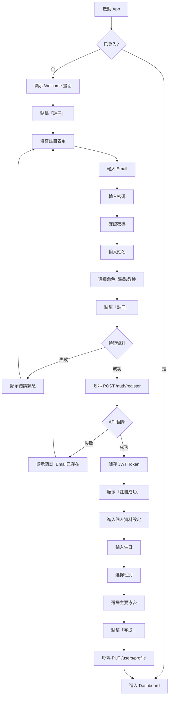

### 1.2 登入流程

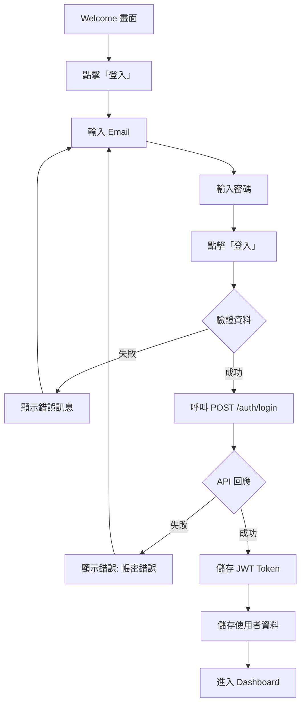

---

## 2. 學員新增成績與自動更新PB

### 2.1 新增比賽成績流程

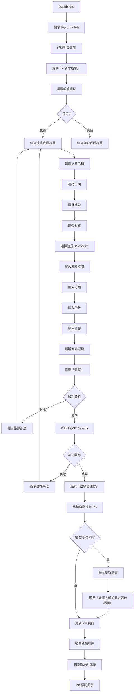

### 2.2 查看 PB 流程

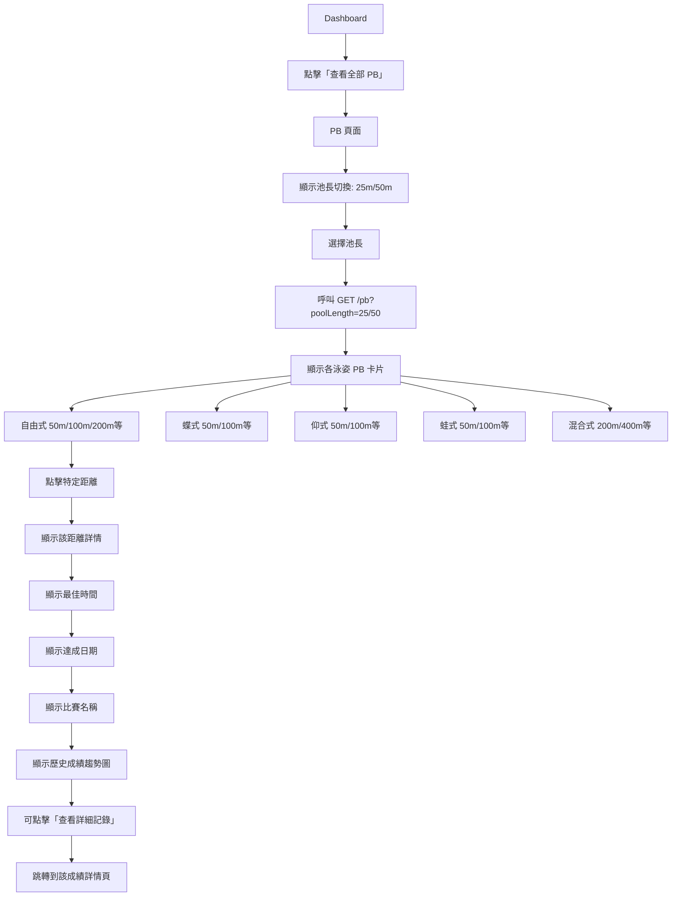

---

## 3. 學員設定與追蹤目標

### 3.1 建立新目標流程

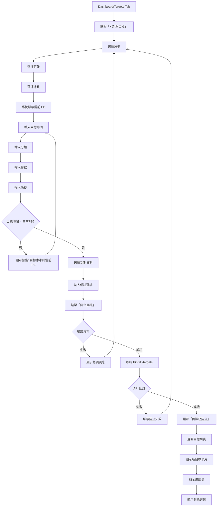

### 3.2 追蹤目標進度流程

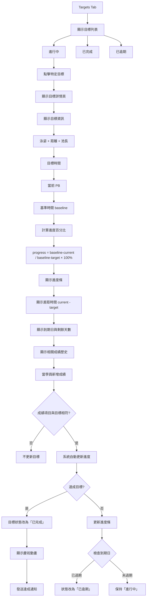

---

## 4. 學員加入隊伍

### 4.1 透過 QR Code 加入

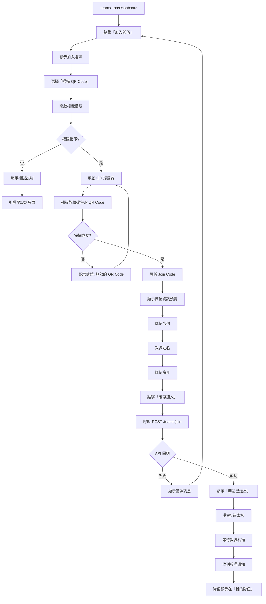

### 4.2 透過邀請碼加入

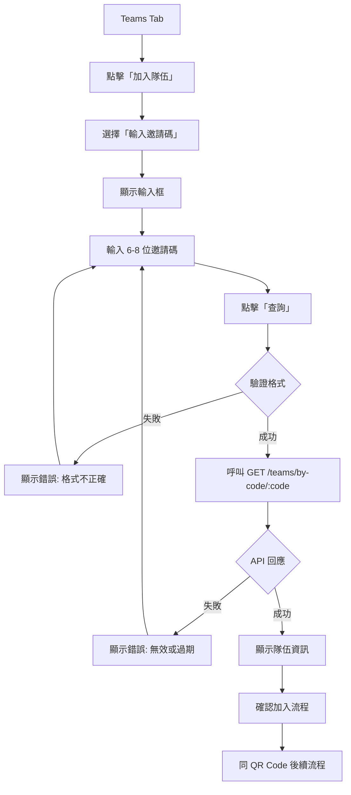

---

## 5. 教練建立隊伍與產生邀請

### 5.1 建立隊伍流程

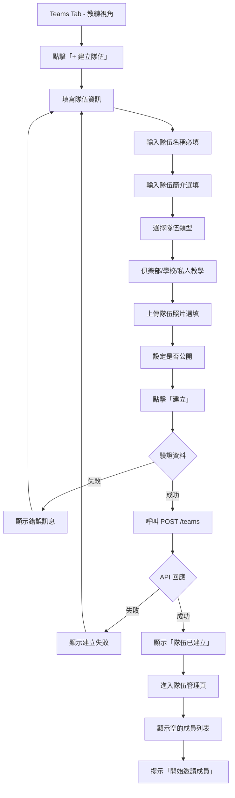

### 5.2 產生邀請碼與 QR Code

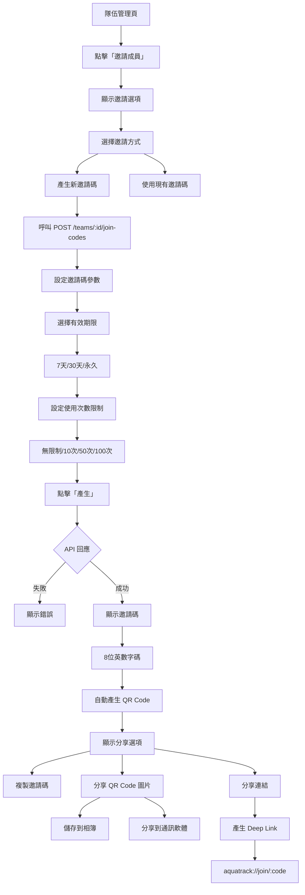

---

## 6. 教練審核學員

### 6.1 審核申請流程

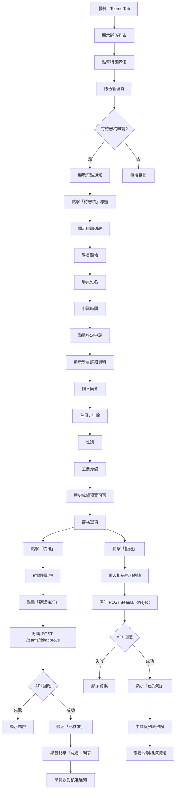

### 6.2 管理現有成員

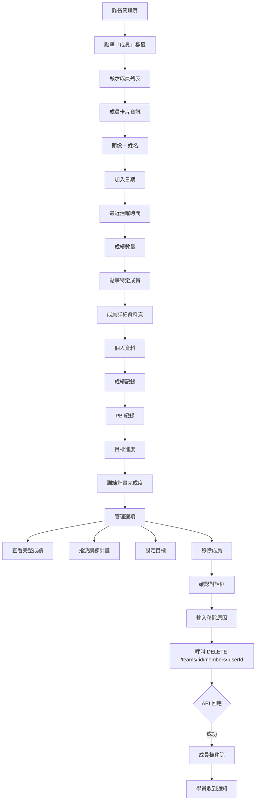

---

## 7. 教練建立與指派課表

### 7.1 建立課表模板流程

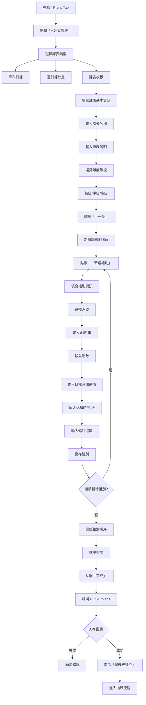

### 7.2 指派課表流程

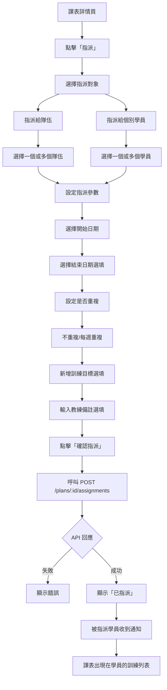

---

## 8. 學員查看與回報訓練

### 8.1 查看訓練計畫

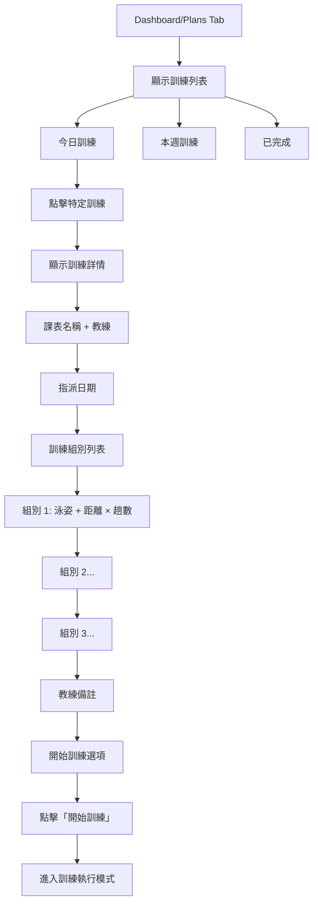

### 8.2 回報訓練完成流程

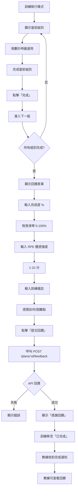

### 8.3 教練查看學員訓練回饋

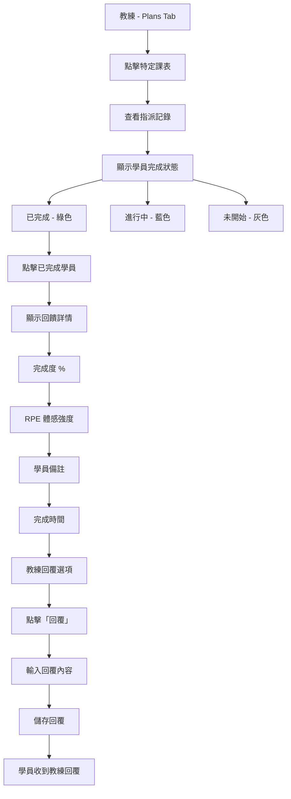

---

## 9. 查看排行榜與比對

### 9.1 排行榜查看流程

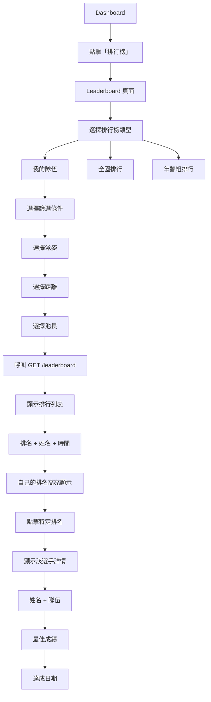

### 9.2 與官方標竿比對

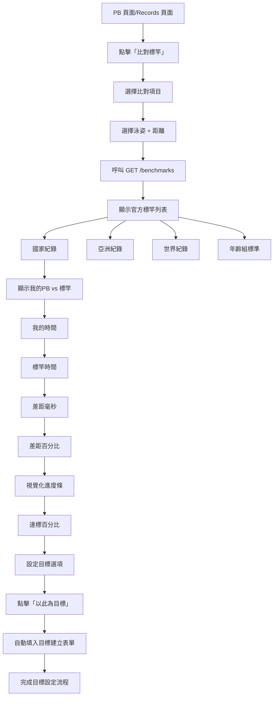

### 9.3 學員間成績比對

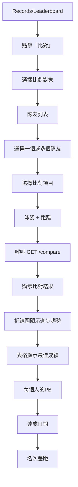

---

## 附錄：關鍵使用者體驗設計原則

### 1. 即時回饋
- 任何資料提交後 200ms 內顯示載入狀態
- 成功/失敗訊息清晰明確
- 打破 PB 時有視覺慶祝效果

### 2. 減少輸入負擔
- 使用選擇器而非手動輸入（泳姿、距離）
- 記住上次輸入的值
- 提供快速填入選項

### 3. 防呆設計
- 目標時間必須小於當前 PB
- 刪除/移除需二次確認
- 重要操作前預覽結果

### 4. 離線優先
- 關鍵資料本地快取
- 離線時可查看歷史記錄
- 網路恢復後自動同步

### 5. 通知策略
- 核准/拒絕即時推送
- 打破 PB 發送通知
- 目標達成/逾期提醒
- 教練指派新訓練通知
